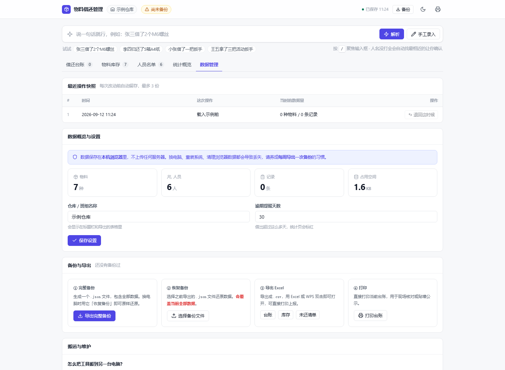
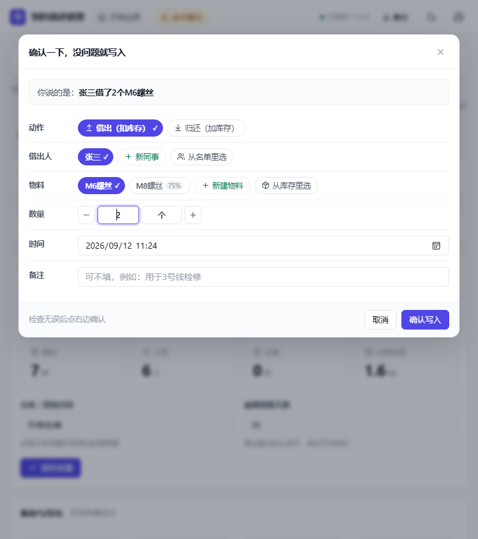
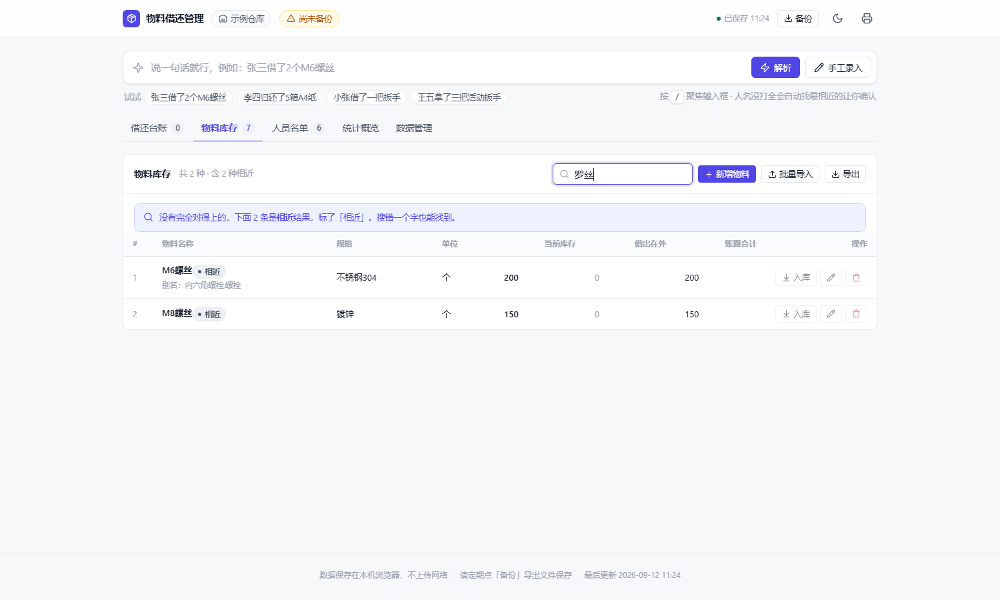
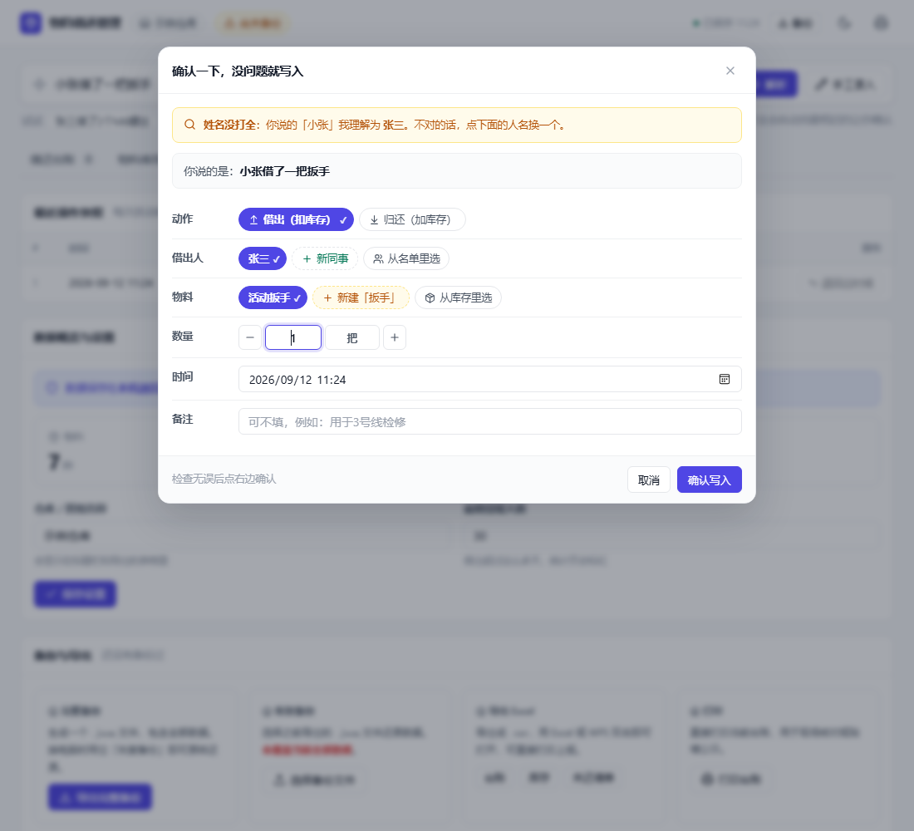
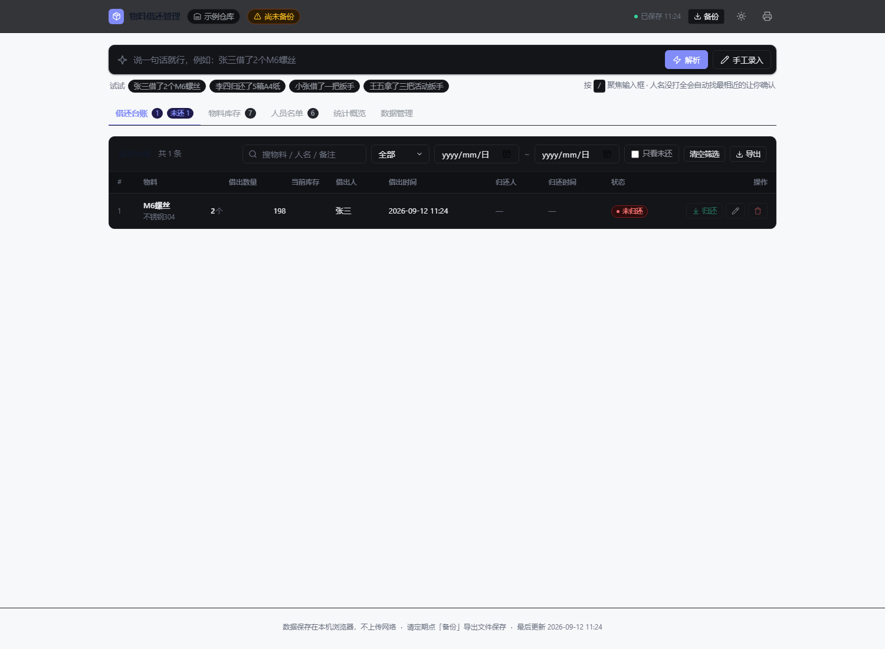
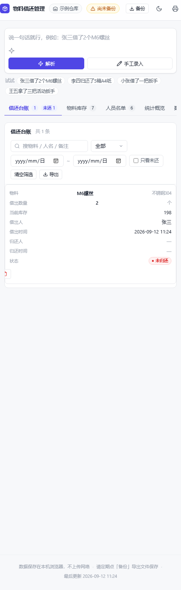

# 物料借还管理 · offline-material-ledger

> **一个不用联网、不用安装、双击就能用的物料借还台账。**
> 整个文件夹拷到哪台电脑都能跑，数据只存在本机浏览器里，不上传任何服务器。

给车间、仓库、实验室这类「东西经常被临时借走」的场景用。核心就一件事：
**记清楚谁借走了什么、什么时候还回来。** 录入方式尽量贴近人话——
「张三借了2个M6螺丝」这样打一句就行，名字打不全、打错一个字也认得出。

English: A single-file, offline material borrow/return ledger that runs by
double-clicking one HTML file. No install, no server, no network. Records are
kept in the browser's local storage.

---

## 它解决什么问题

手工台账（纸本子或 Excel）在这种场景下最容易出三个岔子：

| 麻烦 | 这个工具的做法 |
|---|---|
| 记的时候字写得太随意，事后搜不到 | 一句话录入 + **模糊查找**，打错字、只记得一半也找得到 |
| 借东西的人叫「小王」，名单里写的是「王五」 | 昵称剥离 + 相似度匹配，自动认出来并**让你确认一下** |
| 库存数和实物对不上，还越记越乱 | 库存变更全部集中在几个纯函数里，另有盘点校正和快照退回 |

原则只有一条：**宁可多问一句，也不默默写错数据。**

---

## 主要特性

**录入**
- 一句话录入：`张三借了2个M6螺丝`、`李四归还了5箱A4纸`、`王五拿了三把活动扳手`
- 中文数字（两、三、十五）、全角半角、空格随意
- 数字型号不会被当成数量：`M12螺栓` 不会理解成借了 12 个
- 支持**别名与编码**参与匹配（给「活动扳手」写上别名「扳手, 开口扳手」，同事说「扳手」就认识）
- 昵称剥离：`小张` / `老李` / `阿强` → 去掉前缀再比对
- 置信度分三档：`high` 直接用；`medium`（名字没打全、别名命中）会弹确认框并列出候选让你点选；`low` 提供候选 + 新建

**查找（模糊匹配）**
- 台账、库存、以及「从库存里选 / 从名单里选」的选择框，全部支持模糊查找
- 容错：`罗丝` 能找回 `M6螺丝`，`扳手` 能命中别名，`纸` 能列出 `A4纸`
- **精确命中永远排在前面**，只靠猜的「相近」结果排在后面并打上灰色 `相近` 标记，标题旁注明「含 N 条相近」
- 容错的边界做过专门处理：错一个字能捞回来（`罗丝`→`螺丝`），只是碰巧撞上一个字不算（`手套` 不会误报 `活动扳手`）

**库存**
- 借出扣减、归还增加、部分归还、删除记录自动回滚库存
- 库存不足会拦下来；如果确实是账不准，可以选「照样记」（记为负数）
- 入库 / 盘点校正：在现有库存上增加，或按实物数直接改
- 批量导入：从 Excel 复制几列直接粘贴

**数据与安全**
- 数据存本机 `localStorage`（键 `wl-mgr-db-v2`）
- 每次改动前自动留快照，最多保留 3 份可退回
- 顶栏会提醒「尚未备份」/「已 N 天未备份」
- 导出 CSV（带 BOM，Excel 打开不乱码）、打印台账

**界面**
- 浅色 / 深色双主题，首屏前就恢复，不会闪白
- 窄屏（手机、平板）表格自动转成卡片堆叠
- 无障碍：`role="dialog"` + `aria-modal`、Esc 关闭、Tab 焦点陷阱、`:focus-visible` 焦点环
- 键盘：`/` 跳到输入框、`1~5` 切页、`Ctrl+Shift+L` 切主题、`Esc` 关弹窗

---

## 快速开始

1. 下载仓库里的 **`物料借还管理.html`**（就这一个文件，约 165 KB）
2. 双击打开。如果被记事本之类的软件抢走了，右键 → 打开方式 → Microsoft Edge / Chrome
3. 第一次用建议先做三件事：改仓库名、加物料、加人员名单（也可以先点「载入示例数据」熟悉一下）
4. 之后每次借还，就在最上面那个输入框打一句话

给库管看的非技术说明在 [`使用说明.txt`](使用说明.txt)。

---

## 界面

| 主界面 | 智能录入确认 |
|---|---|
|  |  |

| 模糊查找（故意打错「螺」字） | 名字没打全会让你确认 |
|---|---|
|  |  |

| 深色模式 | 手机窄屏 |
|---|---|
|  |  |

---

## 目录结构

```
├── 物料借还管理.html      ← 交付物：单文件，双击即用
├── 使用说明.txt           ← 给库管看的说明（不含技术内容）
├── src/
│   ├── core.js            ← 纯逻辑：解析、相似度、模糊查找、库存变更（不碰 DOM）
│   ├── ui.js              ← 视图与交互
│   ├── style.css          ← 设计令牌与样式（唯一的设计来源）
│   ├── template.html      ← 外壳模板
│   └── build.js           ← 把上面几个文件合并成单文件 HTML
└── test/
    ├── core.test.js       ← 147 项单元测试
    ├── syntax.js          ← 语法与产物体检
    ├── browser.js         ← Edge 无头渲染，10 个场景截图
    ├── probe.js           ← 模糊查找的 DOM 量化探针（量数值，不看感觉）
    └── shots/             ← 截图产物
```

### 分层约定

`core.js` 是**纯函数**，不依赖 DOM 和浏览器 API，所以：

- Node 端可以直接 `require('./src/core.js')` 跑单元测试，不用起浏览器
- 库存变更**只能**走 `applyBorrow` / `applyReturn` / `applyStockIn` / `applyStockSet`，
  界面层不要直接改 `item.stock`——所有库存规则都锁在这几个函数里

---

## 开发

```bash
# 改完 src/ 后重新打包成单文件
node src/build.js

# 单元测试（147 项）
node test/core.test.js          # 结果写入 test/result.txt

# 语法 + 产物校验
node test/syntax.js             # 结果写入 test/syntax.txt

# 无头浏览器截图（10 个场景）
node test/browser.js            # 截图写入 test/shots/

# 模糊查找的量化探针
node test/probe.js              # 结果写入 test/probe.txt
```

只需要 Node，没有任何 npm 依赖。

`test/browser.js` 和 `test/probe.js` 会调用本机 Edge：
路径写在文件开头的 `EDGE` 常量里，换机器时改一下即可；
它们还会往 `D:\WorkBuddyMemory\ZZH\_browsertest` 写临时文件（纯 ASCII 路径，
避免 `file://` 中文转义问题），如果这个目录不存在请自行调整 `sandbox` 常量。

---

## 数据与隐私

- 所有数据存在**本机浏览器的 localStorage** 里，不联网、不上传、没有后端
- 换浏览器、清缓存、换电脑都会丢，**必须靠「备份」导出 JSON 保平安**
- 多人同时记账需要另做局域网版，当前是单机版

---

## 已知边界

- **单机离线**：同一时刻一台电脑一份数据，不做多机同步
- **不是库存 ERP**：没有采购、入库单、供应商、财务这些，只做借还和库存数
- 归还逾期只在统计里给个数字提醒（默认 30 天），不做通知推送

---

## 开源版与内部版

仓库用两个分支区分同一份代码的两种发布形态：

| 分支 | 用途 | 品牌资源 |
|---|---|---|
| `main` | 开源发布版 | 不含。`brand/` 不提交，由 `.gitignore` 兜底 |
| `kdd` | 内部版 | 含。`brand/` 里的商标图会提交，产物内联公司图标 |

**导出内部版**：

```bash
git checkout kdd
node src/build.js        # 生成带公司图标的 物料借还管理.html
```

`brand/` 只在 `kdd` 分支存在，所以**切回 `main` 时这个目录会消失、切到 `kdd` 时又出现**——
这是 git 的正常行为，不是文件丢了。（`brand/` 里的图另有一份仓库外的备份，
放在 `D:\WorkBuddyMemory\ZZH\_brand-kdd\`。）

内部版的实现方式：`src/template.html` 里把 `brand/icon.ico` 以 base64 直接写进
`<link rel="icon">`，所以产物**仍然是单文件**，不依赖任何外部文件。

> 如果你 fork 了这个仓库，请把 `brand/` 换成自己的品牌资源，不要使用原作者的商标。

---

## 许可

[MIT](LICENSE)
